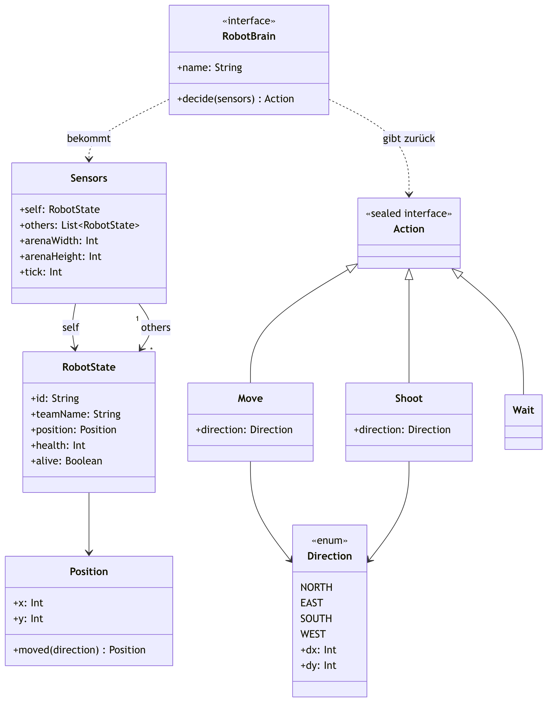
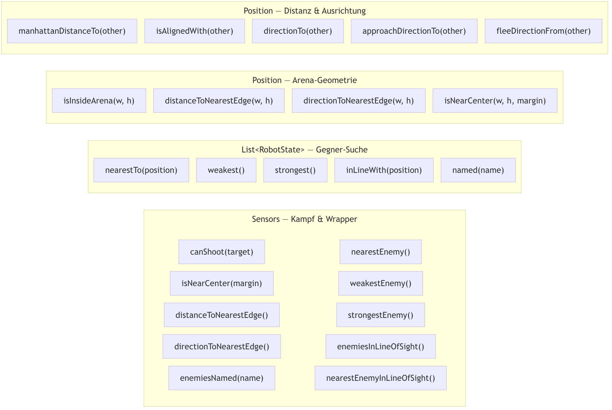

# Modell-Übersicht: Die wichtigsten Objekte

Diese Seite zeigt euch, welche Objekte es im Spiel gibt und wie sie
zusammenhängen. Alles hier ist in `framework/arena/Models.kt` definiert — ihr
müsst diese Datei nicht ändern, nur verstehen, was `decide()` reinbekommt und
zurückgeben muss.

## Klassendiagramm



## Die Objekte kurz erklärt

| Objekt | Was es ist |
|---|---|
| `Direction` | Eine von 4 Richtungen (NORTH/EAST/SOUTH/WEST) — für Bewegen und Schießen. |
| `Position` | Koordinate `(x, y)` auf dem 10×10-Raster. `(0,0)` = oben links. |
| `RobotState` | Zustand **eines** Roboters: wo er steht, wie viel HP er hat, ob er lebt. |
| `Sensors` | Alles, was euer Bot in einem Tick über die Welt sehen darf (siehe unten). |
| `Action` | Was euer Bot tun will: `Move`, `Shoot` oder `Wait`. Genau eine pro Tick. |
| `RobotBrain` | Das Interface, das eure Bot-Klasse implementiert — `decide()` ist eure einzige Aufgabe. |
| `Toolkit.kt` | Fertige Helferfunktionen (Distanz, Richtung, Gegnersuche, Rand/Mitte) für `decide()` — siehe [`toolkit-referenz.md`](toolkit-referenz.md). |

## Der Ablauf in einem Satz

```
Engine baut Sensors  --->  euer decide(sensors)  --->  ihr gebt eine Action zurück
```

Mehr Details zur Nutzung (z.B. wie ihr Gegner findet, Beispielcode) stehen in
[`schueler-framework-guide.md`](schueler-framework-guide.md).

## Toolkit-Funktionen im Überblick



Details zu jeder Funktion (Signatur, Beispiele) stehen in
[`toolkit-referenz.md`](toolkit-referenz.md).
